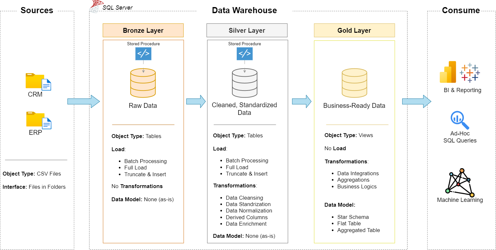

# SQL Data Warehouse Project

**Live write-up: [paulsentongo.dev](https://paulsentongo.dev)**

A SQL Server data warehouse built from scratch on top of raw CRM and ERP exports. I built this as a portfolio project to show what I can actually do with SQL — not a toy exercise, but a full pipeline: raw ingestion, cleansing and standardization, a proper dimensional model, data quality tests, and analytics on top, all in T-SQL.

## The problem this solves

Imagine a company running two systems that never talk to each other: a CRM for customers and sales, and an ERP for products and locations. Each one exports its own CSV files, using its own keys, its own codes, its own idea of what a clean record looks like. Before anyone can build a dashboard on this data, someone has to reconcile it.

That's what this warehouse does. It pulls the raw files in as-is, cleans and standardizes them, resolves the mismatches between the two systems, and lands everything in a star schema that's ready to query directly — no knowledge of the mess underneath required.

## Architecture

The warehouse follows a Medallion (Bronze / Silver / Gold) architecture:



- **Bronze** — raw data loaded as-is from the source CSV files via `BULK INSERT`, no transformation. This is the audit trail.
- **Silver** — cleansed, deduplicated, and standardized. Dates get parsed safely, codes get expanded into readable values, and sales figures that don't add up get recalculated from what's trustworthy. The whole load runs in one transaction, so a failure rolls everything back instead of leaving some tables refreshed and others stale.
- **Gold** — business-ready views modeled as a star schema: two dimensions and one fact table, plus two reporting views built specifically for customer and product analysis.

## Data model

`gold.fact_sales` sits at the center, at a grain of one row per sales order line, joined to `gold.dim_customers` and `gold.dim_products`.


The full reasoning behind the model — why a star schema, the grain, the key strategy, and how missing dimension matches are handled — is written up in [`docs/data_model.md`](docs/data_model.md). Column-level definitions for every Gold table are in [`docs/data_catalog.md`](docs/data_catalog.md).

## Repository structure

```text
SQL_datawarehouse_Project/
├── datasets/                    Raw CRM and ERP CSV exports
├── docs/
│   ├── data_catalog.md          Column-level reference for the Gold layer
│   ├── data_model.md            Data modeling design decisions
│   ├── naming_conventions.md    Naming rules for schemas, tables and columns
│   ├── model_images/            Architecture and data model diagrams
│   ├── layer_explanation/       Medallion layer explanation (PDF)
│   └── Practice/                Standalone SQL practice scripts (joins, set operators, etc.)
├── scripts/
│   ├── init_database.sql        Creates the DataWarehouse database and schemas
│   ├── bronze_layer/            Bronze DDL, load procedure, and exploratory checks
│   ├── silver_layer/            Silver DDL and the load_silver procedure
│   └── gold_layer/              Gold views (star schema) and view-confirmation queries
├── exploratory data analysis/   Runnable analysis scripts: trends, rankings, segmentation,
│                                 cumulative and part-to-whole analysis, customer/product reports
├── tests/                       Data quality and referential-integrity checks
├── index.html, assets/          The landing page for paulsentongo.dev
├── CNAME                        Custom domain for GitHub Pages
└── LICENSE
```

## Tech stack

- **Microsoft SQL Server** — the database engine
- **T-SQL** — every transformation, all the way through; no external ETL tool
- **SQL Server Management Studio** — for development and testing
- **Git / GitHub** — version control and hosting
- **Plain HTML, CSS and JavaScript** — the landing page, no framework or build step

## Running it yourself

1. Run [`scripts/init_database.sql`](scripts/init_database.sql) to create the `DataWarehouse` database and the `bronze` / `silver` / `gold` schemas. This drops and recreates the database if it already exists — read the warning at the top of the script first.
2. Run the DDL and load procedure for each layer, in order:
   - [`scripts/bronze_layer/ddl_bronze_layer.sql`](scripts/bronze_layer/ddl_bronze_layer.sql) then [`scripts/bronze_layer/proc_load_bronze.sql`](scripts/bronze_layer/proc_load_bronze.sql)
   - [`scripts/silver_layer/ddl_silver.sql`](scripts/silver_layer/ddl_silver.sql) then [`scripts/silver_layer/load_silver_layer.sql`](scripts/silver_layer/load_silver_layer.sql)
   - [`scripts/gold_layer/ddl_gold.sql`](scripts/gold_layer/ddl_gold.sql)
3. Before step 2's Bronze load, open `proc_load_bronze.sql` and update the six `BULK INSERT` file paths to wherever you've cloned this repo — `BULK INSERT` reads from the SQL Server host's own file system, not from wherever you're running the script.
4. Run the checks in [`tests/silver_layer_checks.sql`](tests/silver_layer_checks.sql) and [`tests/gold_checks.sql`](tests/gold_checks.sql) to confirm the load is clean.
5. From there, everything in [`exploratory data analysis/`](exploratory%20data%20analysis/) runs directly against the Gold views.

## Analytics on top of the model

The `exploratory data analysis/` folder covers change-over-time trends, cumulative and moving totals, year-over-year performance, part-to-whole contribution by category, magnitude and ranking analysis, and customer/product segmentation — plus two standing reporting views, `gold.report_customers` and `gold.report_products`, that consolidate recency, lifetime value and segment for every customer and product.

## Contact

**Paul Sentongo**
[paulsentongo.dev](https://paulsentongo.dev) · [sentongopol@gmail.com](mailto:sentongopol@gmail.com) · [LinkedIn](https://www.linkedin.com/in/paul-sentongo-885041284/)

## License

[MIT](LICENSE)
